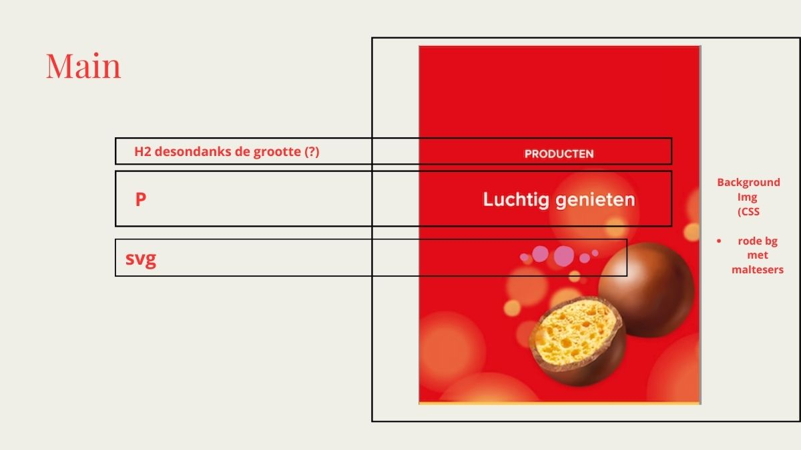
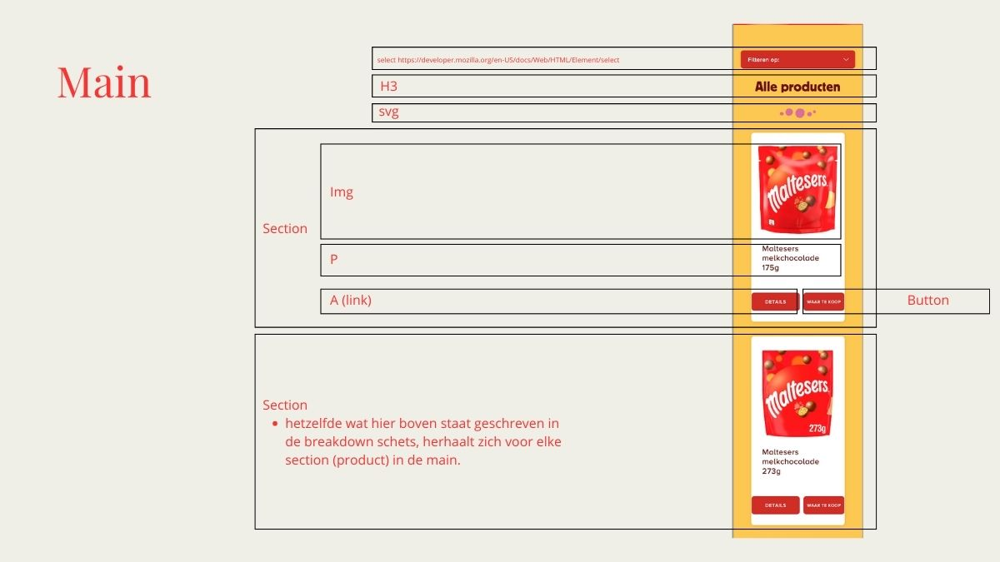
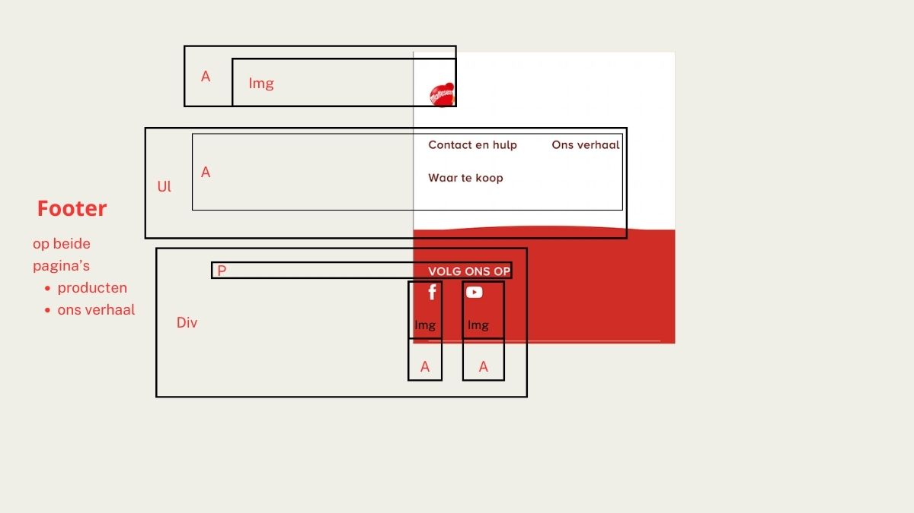
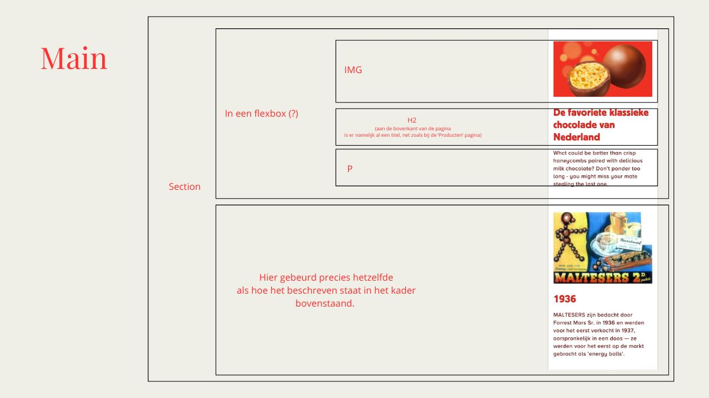
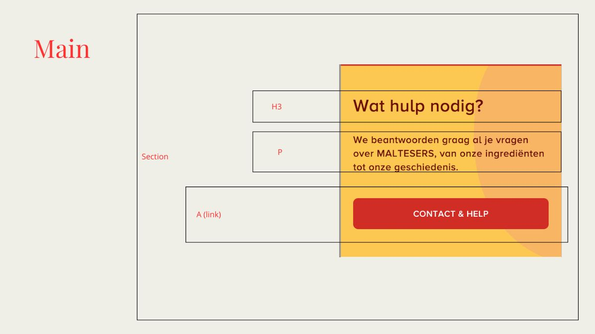

# Procesverslag
Markdown is een simpele manier om HTML te schrijven.  
Markdown cheat cheet: [Hulp bij het schrijven van Markdown](https://github.com/adam-p/markdown-here/wiki/Markdown-Cheatsheet).

Nb. De standaardstructuur en de spartaanse opmaak van de README.md zijn helemaal prima. Het gaat om de inhoud van je procesverslag. Besteedt de tijd voor pracht en praal aan je website.

Nb. Door *open* toe te voegen aan een *details* element kun je deze standaard open zetten. Fijn om dat steeds voor de relevante stuk(ken) te doen.

## Jij

  
uitwerken voor kick-off werkgroep

  ### Auteur:
  Pricilla Clijdesdale

  #### Je startniveau:
  Blauwe piste

  #### Je focus:
  Responsive
 

## Je website

  
uitwerken voor kick-off werkgroep

  ### Je opdracht:
 
  #### Screenshot(s) van de eerste pagina (small screen): 
  

  #### Screenshot(s) van de tweede pagina (small screen):
  
 

## Toegankelijkheidstest 1/2 (week 1)

  
uitwerken na test in 2e werkgroep

  
  
  
  
  

  ### Bevindingen
  Lijst met je bevindingen die in de test naar voren kwamen:

  <ul>
    <li>Ik heb niet goed opgelet, want de website gebruikt wel een lang attribute in de html.</li>
    <li>De website gebruikt ook voor elke pagina een unieke naam, iets waar ik ook niet goed op heb gelet.</li>
    <li>De website overall bevat heel erg veel div's en classjes in de code.</li>
    <li>Bij de producten pagina springt de code van een H1 (luchtig genieten)naar een H3< (Alle producten)./li>
    <li>Doordat veel img elementen geen alt beschrijving hebben, wordt tijdens het gebruiken van de screenreader niet uitgesproken wat er te zien valt. Je hoort alleen 'link, afbeelding, open in nieuw tab'.</li>
    <li>De screenreader leest de a elementen en button's niet op de pagina van Producten.</li>
    <li>Ik ben erachter gekomen dat het verschil tussen een a element en een button is dat bij een a element (linkje) je echt doorverwezen wordt naar een andere pagina, terwijl bij een button je verwezen wordt naar een ander deel / element op dezelfde pagina.</li>
      <li>Op de pagina van Ons verhaal worden de afbeeldingen wel met omschrijvingen uitgesproken door de screenreader.</li>
  </ul>

## Breakdownschets (week 1)

  
uitwerken na afloop 3e werkgroep

  ### de hele pagina: 
  
  
  
  
  

## Voortgang 1 (week 2)

  
uitwerken voor 1e voortgang

  ### Stand van zaken
  hier dit ging goed & dit was lastig (neem ook screenshots op van delen van je website en code)

## Voortgang 2 (week 3)

  
uitwerken voor 2e voortgang

  ### Stand van zaken
  hier dit ging goed & dit was lastig (neem ook screenshots op van delen van je website en code)

## Toegankelijkheidstest 2/2 (week 4)

  
uitwerken na test in 9e werkgroep

  ### Bevindingen
  Lijst met je bevindingen die in de test naar voren kwamen (geef ook aan wat er verbeterd is):

## Voortgang 3 (week 4)

  
uitwerken voor 3e voortgang

  ### Stand van zaken
  hier dit ging goed & dit was lastig (neem ook screenshots op van delen van je website en code)

## Eindgesprek (week 5)

  
uitwerken voor eindgesprek

  ### Je uitkomst - karakteristiek screenshots:
  

  ### Dit ging goed/Heb ik geleerd: 
  Korte omschrijving met plaatjes

  

  ### Dit was lastig/Is niet gelukt:
  Korte omschrijving met plaatjes

  

## Bronnenlijst

  
continu bijhouden terwijl je werkt

  Nb. Wees specifiek ('css-tricks' als bron is bijv. niet specifiek genoeg). 
  Nb. ChatGpT en andere AI horen er ook bij.
  Nb. Vermeld de bronnen ook in je code.

  1. Ik heb eigenlijk alleen de studentassistenten gesproken voor hulp. Op momenten dat ik iets niet meer helemaal begreep of vergeten was, vroeg ik ChatGPT enkel om een simpele uitleg van bepaalde delen uit mijn code. 

