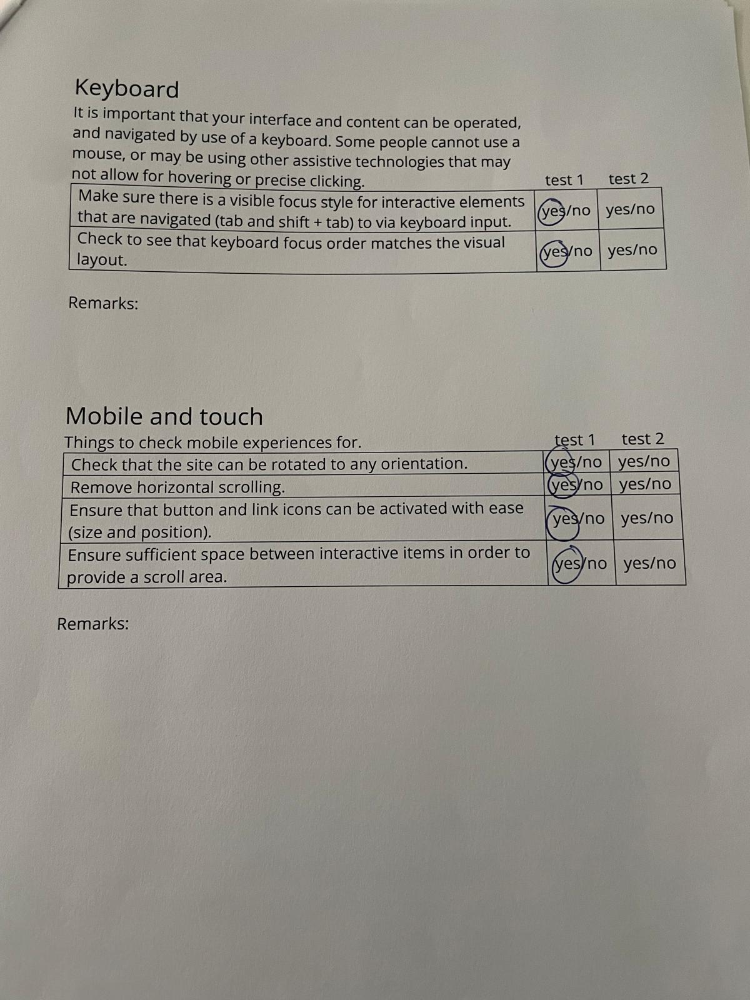
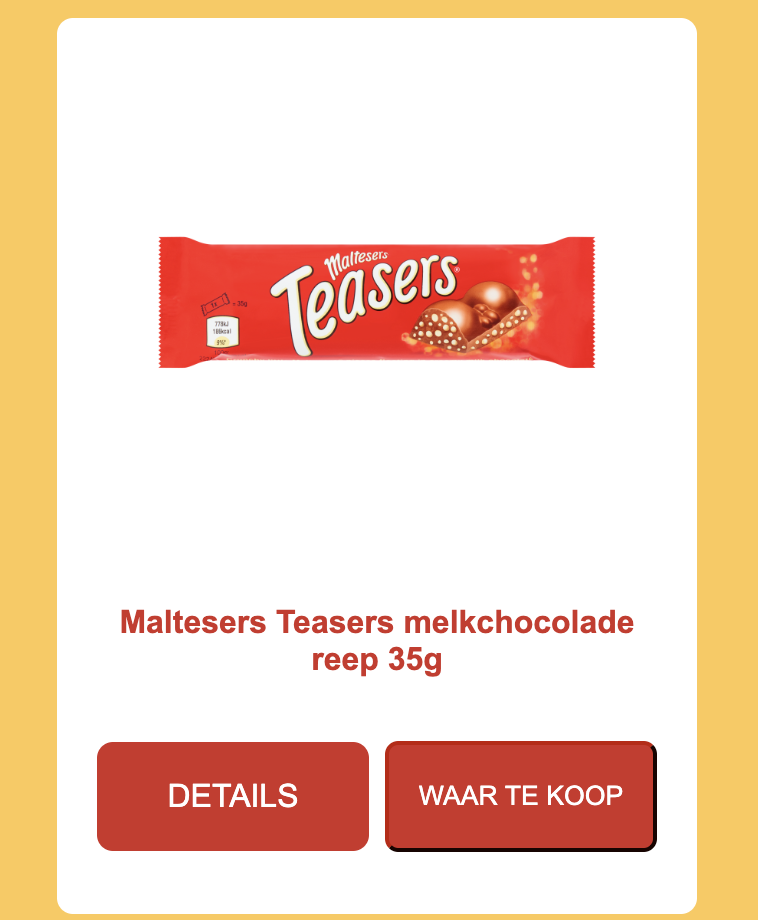

# Procesverslag
Markdown is een simpele manier om HTML te schrijven.  
Markdown cheat cheet: [Hulp bij het schrijven van Markdown](https://github.com/adam-p/markdown-here/wiki/Markdown-Cheatsheet).

Nb. De standaardstructuur en de spartaanse opmaak van de README.md zijn helemaal prima. Het gaat om de inhoud van je procesverslag. Besteedt de tijd voor pracht en praal aan je website.

Nb. Door *open* toe te voegen aan een *details* element kun je deze standaard open zetten. Fijn om dat steeds voor de relevante stuk(ken) te doen.

## Jij

  
uitwerken voor kick-off werkgroep

  ### Auteur:
  Pricilla Clijdesdale

  #### Je startniveau:
  Blauwe piste

  #### Je focus:
  Responsive
 

## Je website

  
uitwerken voor kick-off werkgroep

  ### Je opdracht:
 

  #### Screenshot(s) van de eerste pagina (small screen): 

  #### Screenshot(s) van de tweede pagina (small screen):
  
 

## Toegankelijkheidstest 1/2 (week 1)

  
uitwerken na test in 2e werkgroep

  ### Bevindingen
  
  
  
  
  

  Lijst met je bevindingen die in de test naar voren kwamen:
   Wat mij opvalt van het lezen van de pagina met de screenreader op de pagina Producten:
- Er wordt gesprongen van H1 naar een H3 wat heel raar staat.
- De afbeeldingen hebben geen alt tekst, maar doordat de titel (H3) ook de afbeelding beschrijft is het niet per se een groot probleem voor de toegankelijkheid.
- Alle a elementen worden voor gelezen als ‘bezocht, link,’.
- Alle a elementen die in een andere site openen worden voorgelezen als ‘opent in nieuw venster’.

Wat mij opvalt van het lezen van de pagina met de screenreader op de pagina Ons verhaal:
- Overal wordt er voor de titel een H1 gebruikt.
- Voor de titel die over de afbeelding geschreven staat wordt een article element gebruikt wat niet per se nodig is. 
- Alt teksten van de afbeeldingen kan ik wel teruglezen in de code, alleen worden deze niet voorgelezen tijdens de test met de screenreader. Kan aan mijn screenreader liggen. 

## Breakdownschets (week 1)

  
uitwerken na afloop 3e werkgroep

  ### de hele pagina: 
  
  
  
  

  ### dynamisch deel (bijv menu): 
  
  

## Voortgang 1 (week 2)

  
uitwerken voor 1e voortgang

  ### Stand van zaken
Om heel eerlijk te zijn was ik bij voortgangsgesprek 1 letterlijk nergens met mijn website. Ik heb mij enkel alleen gefocust op de breakdownschets. Dit kwam doordat coderen voor mij echt een FLINK aantal jaren geleden was, en ik zeker van wilde zijn dat de basis voor mijn website waar ik mee begon te bouwen correct zou zijn. 

Het was welliswaar niet super verstandig om ermee te wachten, maar uiteindelijk ben ik wel achter een aantal fouten gekomen.

  ### Verslag van meeting
  hier na afloop snel de uitkomsten van de meeting vastleggen

  - De tip was om mijn breakdownschets voor mezelf snel te verbeteren, maar daarna wel echt aan de slag te gaan met mij code. Al zou het helemaal nergens op lijken, heb je dan toch wel een punt om verder op te bouwen a.d.h.v. feedback. 
  - Omdat ik eigenlijk vrij weinig had om feedback op te krijgen zal ik kleine punten omschrijven van mijn breakdownschets die niet correct waren.
  - Punt 1: Op afbeelding is het woordje 'producten' een H1 in plaats van een H2. Op elke pagina moet je website namelijk beginnen met een H1, en los daarvan is het de titel van de pagina.
  - Punt 2: Het woordje 'Alle producten' is in plaats van een H3 een H2.
  - Punt 3: Alle sections zijn articles. Je wilt op 1 html pagina het liefst zo min mogelijk sections.

## Voortgang 2 (week 3)

  
uitwerken voor 2e voortgang

  ### Stand van zaken
Ik heb er helaas geen screenshots van genomen, which is totally my fault. Ik was te gefocust op het vooruit komen. Echter bij dit gesprek was ik ook niet ver genoeg, om inhoudelijk echt veel feedback te krijgen. Ik liep eigenlijk tegen het feit aan op mijn 'Producten' pagina, dat ik de articles totaal niet wist te stylen in mijn CSS. 

Ik  verloor eigenlijk alle moed en had slechts 2 á 3 vragen die ik kon stellen. Ook hier kreeg ik de feedback om toch door te zetten en echt dagen uit te trekken om een aantal uur te coderen. Op deze manier kun je veel meer feedback verwerken en je codeer skills verbeteren. Het huilen stond mij echt nabij op dit moment, maar voor alsnog mijn eigen schuld. Ik ben aan de slag gegaan met grid-template-columns. En nadat ik doorhad hoe dit exact in elkaar zat, heb ik dit op de hele pagina, waar nodig, toegepast.

Ik moet toegeven dat ik tussen dit voortgangsgesprek en de laatste les, echt een flinke sprong heb kunnen maken.

  ### Verslag van meeting
  hier na afloop snel de uitkomsten van de meeting vastleggen

  - Punt 1: Nu echt actie ondernemen en alles coderen, ook de 'Ons verhaal' pagina. Want die had ik op dat moment nog niet.
  - punt 2: Grid-template-columns onder de knie krijgen. Dat is eigenlijk de 'Gouden sleutel' naar de opmaak binnen mijn website.
  - punt 3: Ervoor zorgen dat ik tijdens de laatste lessen, en het laatste voortgangsgesprek, waar nodig nog de laatste vragen kan stellen.
  - Punt 4: Hieronder kun je de tekening zien die mijn leven gered heeft tijdens het coderen!

## Toegankelijkheidstest 2/2 (week 4)

  
uitwerken na test in 9e werkgroep

  
  
  
  
  

  ### Bevindingen
  Lijst met je bevindingen die in de test naar voren kwamen (geef ook aan wat er verbeterd is):
  Wat mij opvalt van het lezen van de pagina met de screenreader op de pagina Producten

- Ik merk dat hij alles netjes van boven naar beneden afleest
- Wat ik wel verder heel irritant vind is dat hij bij alle linkjes (a elementen) voorleest: bezocht, link, naam van het a element. Dit maakt het best langdradig voor iemand en irritant om achter elkaar te horen. 
- De screenreader leest de headings af als een kopniveau. Bij bijvoorbeeld dus een heading 2 bovenaan de pagina, leest het eerst voor: kopniveau 2 en vervolgens wat er dan staat. 
- Bij p elementen leest hij alleen voor wat er letterlijk staat. 
- Bij alle button elementen leest hij eerst voor wat er staat en dan zegt die erna ‘knop’. 
- De screenreader leest eerst de alt teksten van de afbeelding en zegt daarna vervolgens ‘afbeelding’. Dit maakt het duidelijker voor de doelgroep dat het een afbeelding is die     op de plek staat. 

Op de andere pagina die ik heb gecodeerd, de pagina Over Ons van Maltesers gebeuren er geen buitengewone dingen. 

## Voortgang 3 (week 4)

  
uitwerken voor 3e voortgang

  ### Stand van zaken
Ik was hier eigenlijk al heel ver met mijn website. Dat komt grotendeels doordat beide pagina's zowel aan de bovenkant (navigatie), als aan de onderkant (footer) gelijk zijn. Ik kon dat dus makkelijk copy pasten. Het enige waar ik tegenaan liep was mijn hamburger menu. Deze moest nog op groot scherm werken, en dit kon door middel van media quieries. Ik had hier nog geen aandacht aan besteed, maar ging in de les eigenlijk direct goed. 

Wat ik lastig vond verder, is dat ik de schaduw van mijn button niet wegkrijg. Zie afbeelding hieronder:

- Ik heb dit geprobeerd met box-shadow:none, alleen heeft dit niet succesvol gewerkt.

Wat ik als tweede punt lastig vond, en uiteindelijk wel heb kunnen oplossen, is tijdens de laatste les de teksten goed krijgen van mijn 'Ons verhaal' pagina. Zie afbeelding hieronder:

- Ik heb een container om de H2 en p gezet, zodat ik kan vertellen aan mijn code dat in mijn grid-column-template de img naar links moet en de container met de teksten naar rechts.
- In de afbeelding hierboven stond mijn code goed, maar het zag er niet uit.

Wat ik als laatste punt lastig vond, is de light dark mode. Ik was eerst even gestresst, omdat ik niet wist hoe dit moest. Maar dankij de PPT presentatie 'Themes' heb ik geleerd hoe dit moest. Ook heb ik hierdoor ondervonden hoe belangrijk het is om custom properties te hebben binnen de CSS. Zie afbeelding hieronder van mijn basis knopjes:

## Eindgesprek (week 5)

  
uitwerken voor eindgesprek

  ### Je uitkomst - karakteristiek screenshots:
  

  ### Dit ging goed/Heb ik geleerd: 
  Korte omschrijving met plaatjes

  

  ### Dit was lastig/Is niet gelukt:
  Korte omschrijving met plaatjes

  

## Bronnenlijst

  
continu bijhouden terwijl je werkt

  Nb. Wees specifiek ('css-tricks' als bron is bijv. niet specifiek genoeg). 
  Nb. ChatGpT en andere AI horen er ook bij.
  Nb. Vermeld de bronnen ook in je code.

  1. Voor de tussentijdsgesprekken en ook tijdens de lessen heb ik hulp gehad van beide studentassistenten. Ik heb voornamelijk hulp gekregen bij het responsive maken, omdat ik dat nogal lastig vond. Ook heb ik geleerd hoe ik om kan gaan met het vormgeven van bijvoorbeeld articles door het gebruiken van grid templates. It literally saved my LIFE!
  2. Voor het maken van mijn filter knop bovenaan de 'Producten' pagina, heb ik als tip gekeken op de site van w3schools. De site: https://www.w3schools.com/tags/tag_select.asp.
  3. Voor het opfrissen van mijn geheugen heb ik af en toe ChatGPT gebruikt, o.a. ook om te checken of ik onnodige code/dubbele code had geschreven in mijn css.
  4. Voor het maken van mijn hamburger menu heb ik de opdracht gevolgd van Sanne die ons in de les is gegeven. Ook dit was een lifesaver.
  5. Voor het instellen van de Light en Dark mode heb ik de opdracht gebruikt uit de PPT presentaties 'Themes' die ergens voor de kerstvakantie is gegeven. 

